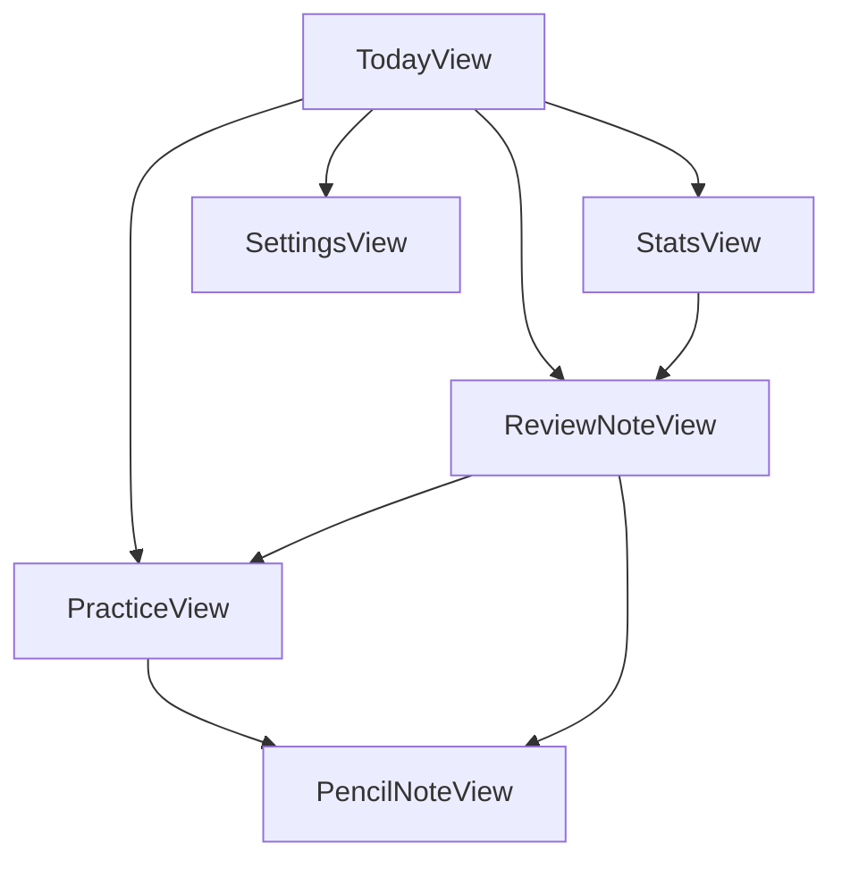

# So02House iOS Screen Flow

## 결론
MVP 화면은 TodayView를 시작점으로 두고, PracticeView와 ReviewNoteView를 가장 짧은 경로로 연결한다. iPhone은 단일 NavigationStack, iPad는 NavigationSplitView를 우선 검토한다.

## 화면 목록
- TodayView: 오늘 4문제, 완료 수, 복습 수, 어려움 수 표시.
- PracticeView: 문제 카드, 유형 배지, 가이드, 상태 기록 버튼.
- ReviewNoteView: 전체 / 다시 보기 / 어려움 필터와 복습 문제 목록.
- StatsView: 과목별 기록 수, 유형별 기록 수, 어려움 누적 현황.
- SettingsView: 데이터 버전, 기록 초기화, 표시 옵션.
- PencilNoteView: 문제별 손글씨 메모 작성과 재열람.

## 기본 이동 흐름

## TodayView
- 오늘 날짜와 `오늘 완료 n/4`를 상단에 표시한다.
- CTA는 `오늘 4문제 시작`, `복습노트`, `통계`로 제한한다.
- 오늘 출제된 4문제의 유형과 과목 요약을 작은 리스트로 보여준다.

## PracticeView
- 상단: `1/4 문제`, `기록 0/4`.
- 카드: 유형 배지, 과목, section, 연도, 문제 원문.
- 하단: `완료 / 다시 보기 / 어려움`.
- 마지막 문제 상태 선택 시 결과 요약으로 이동한다.
- 문제별 PencilNoteView 진입 버튼은 iPad에서 더 강조한다.

## ReviewNoteView
- 상단 필터: 전체 / 다시 보기 / 어려움.
- 리스트 항목: 유형 배지, 과목, section, 연도, 문제 원문 일부.
- 항목 선택 시 문제 상세 또는 PracticeView 단일 문제 모드로 진입한다.

## StatsView
- MVP에서는 단순 집계만 둔다.
- 과목별 완료 수, 복습 수, 어려움 수.
- 실기/구술별 완료 수.
- 후속으로 streak, 주간 학습량, section 약점 분석을 추가한다.

## SettingsView
- 문제 데이터 버전.
- 기록 초기화.
- 원문 문제 데이터 출처 안내.
- Xcode 개발 초기에는 디버그용 JSON 로딩 상태도 표시 가능하나 배포 전 제거한다.

## PencilNoteView
- 문제 정보 상단 고정.
- iPad: PKCanvasView 중심.
- iPhone: 손글씨 메모는 보기 중심, 텍스트 메모를 우선 검토한다.
- 저장은 문제 id 기준으로 자동 저장한다.

## iPhone 세로 기준
- NavigationStack 단일 흐름.
- TodayView -> PracticeView -> 결과 -> TodayView.
- 복습노트는 리스트 중심.
- 상태 버튼은 하단 고정 또는 카드 하단 배치.

## iPad 세로 기준
- NavigationStack도 가능하지만, 화면 폭이 충분하면 목록 + 상세를 검토한다.
- TodayView에서 오늘 문제 리스트와 진행 카드가 함께 보여도 된다.
- PencilNoteView는 전체 화면 modal 또는 detail column으로 연다.

## iPad 가로 기준
- NavigationSplitView 권장.
- Sidebar: Today, Practice, Review, Stats, Settings.
- Detail: 선택된 화면.
- PracticeView와 PencilNoteView는 나란히 배치하는 후속 고도화 후보.

## 참고 링크
- NavigationSplitView: https://developer.apple.com/documentation/SwiftUI/NavigationSplitView
- Split views HIG: https://developer.apple.com/design/human-interface-guidelines/split-views

끝.
